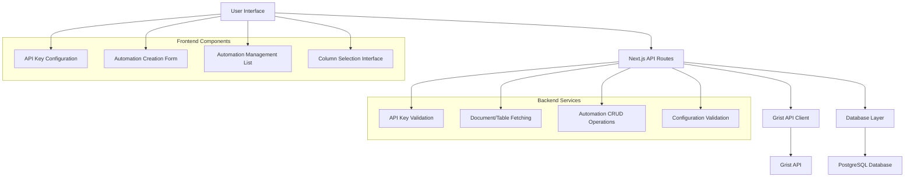

# Design Document

## Overview

The Grist Automation Management feature enables authenticated public agents to create, configure, and manage table copy automations between Grist documents. The system integrates with the Grist API to provide a user-friendly interface for automation configuration while storing automation metadata in the database for execution by external services.

The feature extends the existing administration interface with new pages for API key management and automation configuration, leveraging the current authentication and security infrastructure.

## Architecture

### High-Level Architecture



### Integration Points

- **Grist API**: RESTful API for document, table, and column metadata retrieval
- **Database**: Extended Prisma schema for automation storage
- **Authentication**: Leverages existing NextAuth.js session management
- **UI Framework**: Uses existing DSFR components and styling

## Components and Interfaces

### Frontend Components

#### 1. API Key Configuration Component (`src/components/admin/GristApiKeyConfig.tsx`)

```typescript
interface GristApiKeyConfigProps {
  currentApiKey?: string;
  onApiKeyUpdate: (apiKey: string) => Promise<void>;
}

interface GristApiKeyConfigState {
  apiKey: string;
  isValidating: boolean;
  validationError?: string;
  isValid?: boolean;
}
```

**Responsibilities:**

- Display API key input form with secure handling
- Validate API key by testing Grist API connectivity
- Show validation status and error messages
- Handle API key updates with proper feedback

#### 2. Automation Creation Form (`src/components/admin/AutomationCreationForm.tsx`)

```typescript
interface AutomationFormData {
  name: string;
  sourceDocumentId: string;
  sourceTableId: string;
  targetDocumentId: string;
  targetTableId: string;
  selectedColumns: string[];
  description?: string;
}

interface AutomationCreationFormProps {
  onSubmit: (data: AutomationFormData) => Promise<void>;
  onCancel: () => void;
}
```

**Responsibilities:**

- Multi-step form for automation configuration
- Dynamic loading of documents and tables from Grist API
- Column selection with validation
- Form validation and error handling

#### 3. Automation Management List (`src/components/admin/AutomationList.tsx`)

```typescript
interface AutomationListItem {
  id: string;
  name: string;
  sourceDocument: string;
  sourceTable: string;
  targetDocument: string;
  targetTable: string;
  status: "active" | "inactive" | "error";
  lastExecuted?: Date;
  createdAt: Date;
}

interface AutomationListProps {
  automations: AutomationListItem[];
  onEdit: (id: string) => void;
  onDelete: (id: string) => Promise<void>;
  onToggleStatus: (id: string, status: "active" | "inactive") => Promise<void>;
}
```

**Responsibilities:**

- Display list of user's automations
- Provide actions for edit, delete, and status toggle
- Show automation status and metadata
- Handle bulk operations

### Backend API Routes

#### 1. API Key Management (`src/pages/api/admin/grist-api-key.ts`)

```typescript
// GET /api/admin/grist-api-key
interface GetApiKeyResponse {
  hasApiKey: boolean;
  isValid?: boolean;
}

// POST /api/admin/grist-api-key
interface SetApiKeyRequest {
  apiKey: string;
}

interface SetApiKeyResponse {
  success: boolean;
  isValid: boolean;
  error?: string;
}
```

#### 2. Grist Documents API (`src/pages/api/admin/grist/documents.ts`)

```typescript
// GET /api/admin/grist/documents
interface GristDocument {
  id: string;
  name: string;
  urlId: string;
}

interface GetDocumentsResponse {
  documents: GristDocument[];
}
```

#### 3. Grist Tables API (`src/pages/api/admin/grist/tables.ts`)

```typescript
// GET /api/admin/grist/tables?documentId=xxx
interface GristTable {
  id: string;
  tableId: string;
  columns: GristColumn[];
}

interface GristColumn {
  id: string;
  colId: string;
  type: string;
  label: string;
}

interface GetTablesResponse {
  tables: GristTable[];
}
```

#### 4. Automation Management (`src/pages/api/admin/automations.ts`)

```typescript
// GET /api/admin/automations
interface GetAutomationsResponse {
  automations: AutomationWithMetadata[];
}

// POST /api/admin/automations
interface CreateAutomationRequest {
  name: string;
  type: "table_copy";
  sourceDocumentId: string;
  sourceTableId: string;
  targetDocumentId: string;
  targetTableId: string;
  selectedColumns: string[];
  description?: string;
}

// PUT /api/admin/automations/[id]
// DELETE /api/admin/automations/[id]
```

### Service Layer

#### Grist API Client (`src/lib/grist/client.ts`)

```typescript
interface GristApiClient {
  validateApiKey(apiKey: string): Promise<boolean>;
  getDocuments(apiKey: string): Promise<GristDocument[]>;
  getTables(apiKey: string, documentId: string): Promise<GristTable[]>;
  getTableSchema(
    apiKey: string,
    documentId: string,
    tableId: string
  ): Promise<GristColumn[]>;
}
```

**Key Methods:**

- `validateApiKey()`: Test API key validity with a simple API call
- `getDocuments()`: Fetch user's accessible Grist documents
- `getTables()`: Get tables for a specific document
- `getTableSchema()`: Get column information for a table

## Data Models

### Database Schema Extensions

```prisma
model User {
  // ... existing fields
  gristApiKey     String?   @map("grist_api_key") // Encrypted
  gristApiKeyHash String?   @map("grist_api_key_hash") // For validation
  automations     Automation[]
}

model Automation {
  id                String   @id @default(cuid())
  userId            String   @map("user_id")
  name              String
  description       String?
  type              String   @default("table_copy") // Future: other automation types
  status            String   @default("active") // active, inactive, error

  // Source configuration
  sourceDocumentId  String   @map("source_document_id")
  sourceDocumentName String  @map("source_document_name")
  sourceTableId     String   @map("source_table_id")
  sourceTableName   String   @map("source_table_name")

  // Target configuration
  targetDocumentId  String   @map("target_document_id")
  targetDocumentName String  @map("target_document_name")
  targetTableId     String   @map("target_table_id")
  targetTableName   String   @map("target_table_name")

  // Column configuration
  selectedColumns   Json     @map("selected_columns") // Array of column IDs
  columnMapping     Json?    @map("column_mapping") // Future: custom column mapping

  // Execution metadata
  lastExecuted      DateTime? @map("last_executed")
  lastExecutionStatus String? @map("last_execution_status")
  lastExecutionError String? @map("last_execution_error")

  // Timestamps
  createdAt         DateTime @default(now()) @map("created_at")
  updatedAt         DateTime @updatedAt @map("updated_at")

  user User @relation(fields: [userId], references: [id], onDelete: Cascade)

  @@map("automations")
}
```

### Grist API Data Models

```typescript
interface GristDocument {
  id: string;
  name: string;
  urlId: string;
  access: "owners" | "editors" | "viewers";
}

interface GristTable {
  id: string;
  tableId: string;
  columns: GristColumn[];
}

interface GristColumn {
  id: string;
  colId: string;
  type:
    | "Text"
    | "Numeric"
    | "Int"
    | "Bool"
    | "Date"
    | "DateTime"
    | "Choice"
    | "Ref";
  label: string;
  isFormula: boolean;
}
```

## Error Handling

### API Key Validation Errors

- **Invalid API Key**: Clear error message with instructions to check key
- **Network Errors**: Retry mechanism with exponential backoff
- **Rate Limiting**: Proper handling of Grist API rate limits

### Automation Configuration Errors

- **Document Access**: Validate user has access to both source and target documents
- **Table Existence**: Verify tables exist before saving automation
- **Column Compatibility**: Warn about type mismatches but allow configuration
- **Validation Failures**: Detailed error messages for each validation step

### Database Errors

- **Constraint Violations**: Handle unique constraints and foreign key errors
- **Connection Issues**: Graceful degradation with user feedback
- **Transaction Failures**: Proper rollback and error reporting

## Testing Strategy

### Unit Tests

#### Frontend Components

- **API Key Configuration**: Test validation states, error handling, success flows
- **Automation Form**: Test form validation, dynamic loading, submission
- **Automation List**: Test rendering, actions, state management

#### Backend Services

- **Grist API Client**: Mock API responses, test error handling, rate limiting
- **Database Operations**: Test CRUD operations, validation, constraints
- **API Routes**: Test authentication, validation, error responses

### Integration Tests

#### API Integration

- **Grist API**: Test with real API (using test account) for key validation
- **Database Integration**: Test full automation lifecycle with database
- **Authentication Flow**: Verify proper session handling and authorization

#### End-to-End Tests

- **Complete Automation Creation**: From API key setup to automation creation
- **Error Scenarios**: Test various failure modes and recovery
- **User Experience**: Test complete user workflows

### Security Testing

#### API Key Security

- **Encryption**: Verify API keys are properly encrypted in database
- **Access Control**: Ensure users can only access their own automations
- **Input Validation**: Test against injection attacks and malformed data

#### Authorization Testing

- **Public Agent Verification**: Ensure only public agents can access features
- **Session Management**: Test session timeout and invalidation
- **CSRF Protection**: Verify CSRF tokens are properly implemented

## Performance Considerations

### Grist API Optimization

- **Caching**: Cache document and table metadata for short periods
- **Rate Limiting**: Implement client-side rate limiting to respect Grist API limits
- **Batch Operations**: Group API calls where possible to reduce requests

### Database Optimization

- **Indexing**: Add indexes on userId, status, and frequently queried fields
- **Query Optimization**: Use efficient queries for automation listing and filtering
- **Connection Pooling**: Leverage existing Prisma connection pooling

### Frontend Performance

- **Lazy Loading**: Load documents and tables on demand
- **Debouncing**: Debounce API calls during form interactions
- **Caching**: Cache API responses in component state or React Query

## Security Considerations

### API Key Management

- **Encryption**: Store API keys encrypted using industry-standard encryption
- **Access Control**: Strict user isolation for API key access
- **Audit Logging**: Log API key changes and usage

### Data Protection

- **Input Sanitization**: Sanitize all user inputs before database storage
- **SQL Injection Prevention**: Use Prisma's built-in protection
- **XSS Prevention**: Proper output encoding in React components

### Authentication Integration

- **Session Validation**: Verify user sessions on all API endpoints
- **Public Agent Check**: Ensure only verified public agents can access features
- **CSRF Protection**: Implement CSRF tokens for state-changing operations
